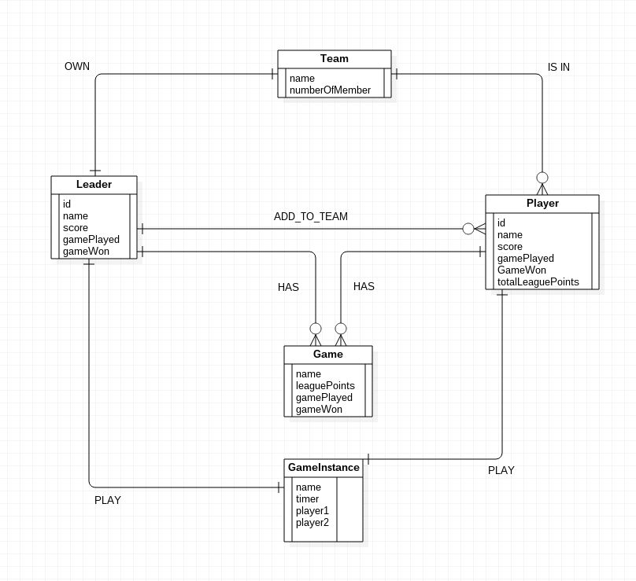
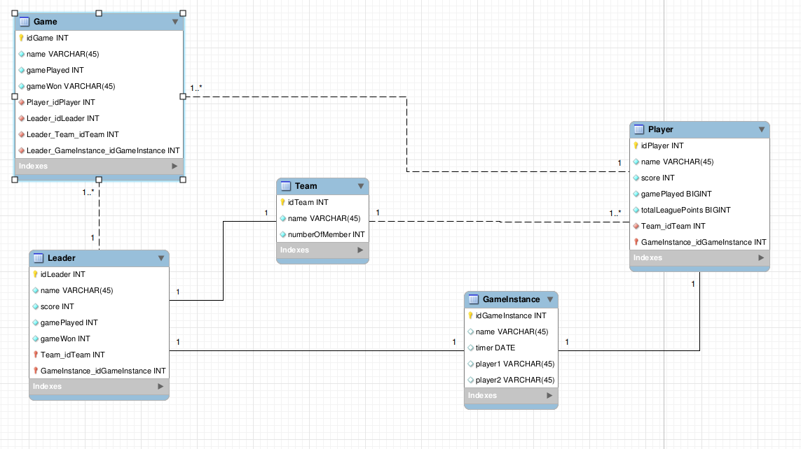

# Player Leagues

## Exporter une base de donnée mysql
```
mysqldump -u username -p database_name > data-dump.sql
```

## Importer une base de donnée mysql 

Se connecter :
```
mysql -u root -p
```
Créer une nouvelle base donnée :
```
CREATE DATABASE new_database;
```
Quitter mysql en faisant ```CTRL+D``` puis importer la base de donnée :
```
mysql -u username -p new_database < data-dump.sql

```
## Schémas entitées relations



## Schéma physique de la base de donnée




